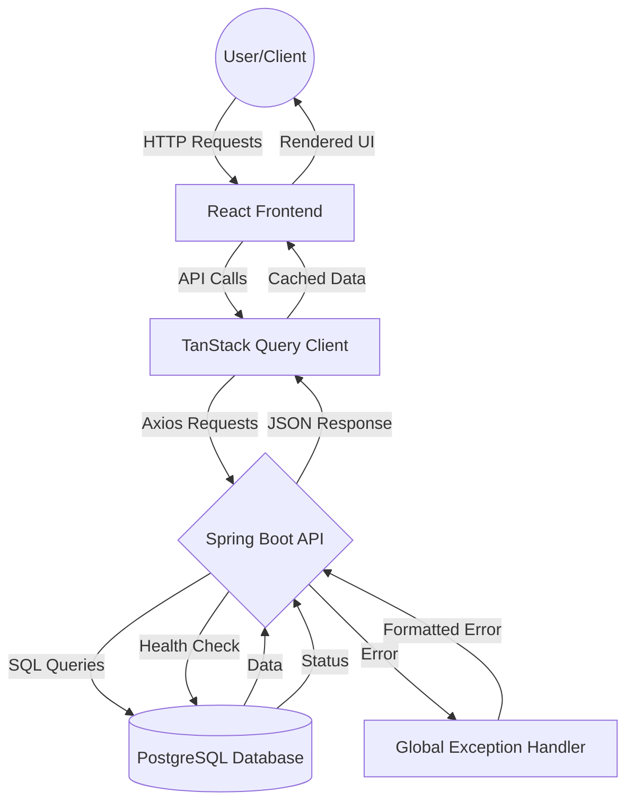

# Property Manager

A modern property management system built with Spring Boot and React.

## Features

- RESTful API for property management
- React frontend with Vite
- Docker support for development and testing
- Automated tests with H2 in-memory database
- PostgreSQL database for production

## Tech Stack

### Backend
- Java 17
- Spring Boot
- Spring Data JPA
- PostgreSQL
- H2 Database (for testing)
- Gradle

### Frontend
- React 18
- TypeScript
- Vite
- TanStack Query
- Axios

### DevOps
- Docker
- Docker Compose
- Git

## Prerequisites

- Docker and Docker Compose
- Java 17 (for local development)
- Node.js 20+ (for local frontend development)

## Getting Started

1. Clone the repository:
```bash
git clone https://github.com/yourusername/property-manager.git
cd property-manager
```

2. Start the application using Docker Compose:
```bash
docker-compose up
```

The services will be available at:
- Frontend: http://localhost:5173
- Backend API: http://localhost:8081
- Database: localhost:5432

## Development

### Running Backend Locally

```bash
./gradlew bootRun
```

### Running Frontend Locally

```bash
cd frontend
npm install
npm run dev
```

### Running Tests

Using Docker:
```bash
# Run all tests
docker-compose run --rm test

# Run specific test class
docker-compose run --rm test ./gradlew test --tests "com.propertymanager.controller.PropertyControllerTest"

# Run tests with detailed output
docker-compose run --rm test ./gradlew test --info
```

Locally:
```bash
./gradlew test
```

## API Endpoints

### Properties

- `GET /api/properties` - Get all properties
- `GET /api/properties/{id}` - Get a specific property
- `POST /api/properties` - Create a new property
- `PUT /api/properties/{id}` - Update an existing property
- `DELETE /api/properties/{id}` - Delete a property

### Sample Request Body (POST/PUT)

```json
{
    "address": "123 Test St",
    "price": 250000.00,
    "bedrooms": 3,
    "bathrooms": 2,
    "squareFootage": 2000.0
}
```

## Application Architecture

### Data Flow Diagram



### Key Components

1. **Frontend Layer**:
   - React application with TypeScript
   - TanStack Query for data fetching and caching
   - Axios for HTTP requests

2. **Backend Layer**:
   - Spring Boot REST API
   - Global Exception Handler for error management
   - Health check endpoint for monitoring

3. **Data Layer**:
   - PostgreSQL database
   - JDBC Template for database operations

### Data Flows
- User interactions trigger HTTP requests from the frontend
- TanStack Query manages API calls and caching
- Spring Boot controllers process requests
- Database queries are executed through JDBC Template
- Errors are handled by the Global Exception Handler
- Health checks monitor system status
